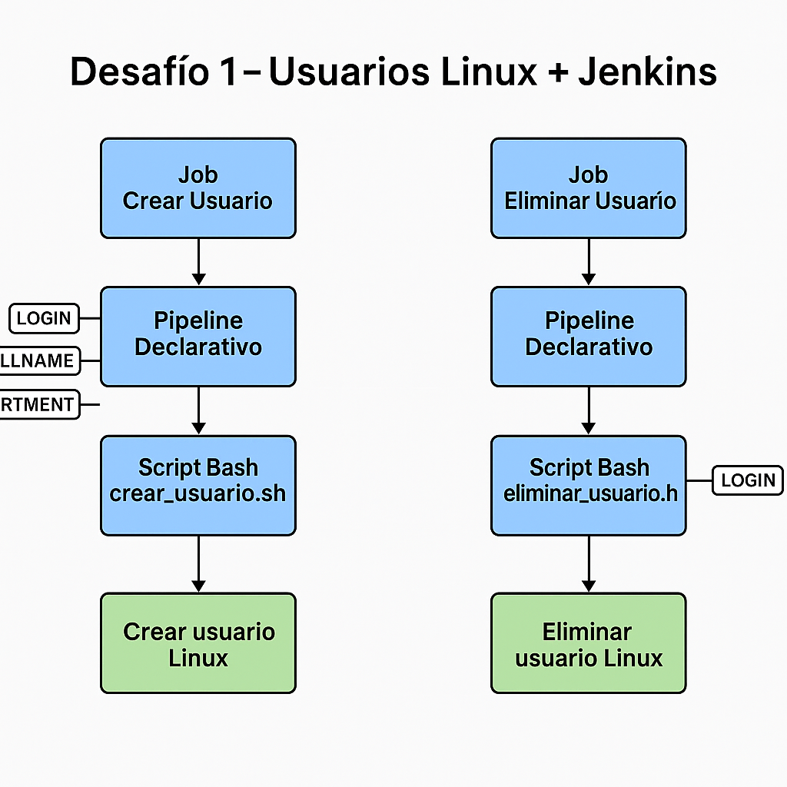

# Desafío 1 - Usuarios Linux + Jenkins

Este desafío automatiza la gestión de usuarios en Linux mediante Jenkins Pipelines.

---

## 📌 Objetivo

Crear dos jobs en Jenkins para:

- ✅ Crear un usuario Linux con login, nombre completo y departamento
- ❌ Eliminar un usuario, su grupo y su carpeta home

---

## 📂 Estructura del proyecto

desafio_1_usuarios_linux_jenkins/
└── evidencia/
    ├── evidencia_creacion.txt
    └── evidencia_eliminacion.txt

---

## 🔧 Jenkins Jobs

### 1. ✅ Crear Usuario

- **Pipeline**: `Jenkinsfile_crear_usuario`
- **Parámetros requeridos**:
  - `LOGIN`: identificador único (nombre_apellido)
  - `FULLNAME`: nombre y apellido del usuario
  - `DEPARTMENT`: contabilidad, finanzas o tecnologia
- **Resultado**:
  - Usuario creado con grupo
  - Password temporal generada y visible en log
  - Password obligatoriamente renovada en primer login

---

### 2. ❌ Eliminar Usuario

- **Pipeline**: `Jenkinsfile_eliminar_usuario`
- **Parámetro requerido**:
  - `LOGIN`: nombre del usuario a eliminar
- **Resultado**:
  - Se elimina el usuario, su carpeta `/home/usuario`, y su grupo (si está vacío)

---

## 📄 Evidencia

Se realizaron pruebas en entorno de desarrollo, cuyos resultados se reflejan en los siguientes archivos:

- `evidencia/evidencia_creacion.txt`: salida del Job de creación
- `evidencia/evidencia_eliminacion.txt`: salida del Job de eliminación

---

## 📊 Diagrama de alto nivel

---

📄 **Descargar guía formal del desafío:**
[documentacion_desafio_1.docx](./documentacion_desafio_1.docx)